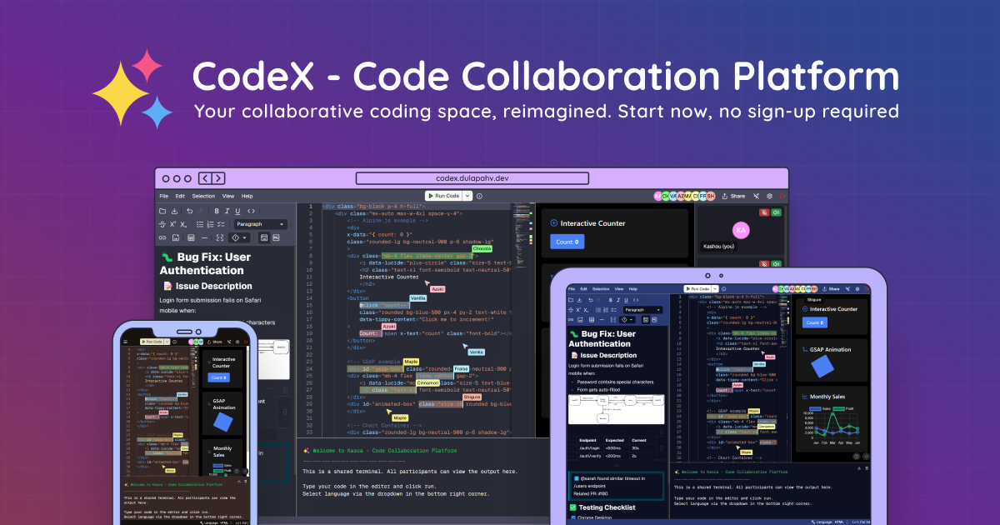

# Code Editor - Code Collaboration Platform

**Created by [Nishant Makwana](https://nishantmakwanaa.lovable.app)**

[](https://linkedin.com/in/nishantmakwanaa)
[](https://github.com/nishantmakwanaa)
[](https://nishantmakwanaa.lovable.app)

<div align="center">
  
</div>

<br />

**Code Editor is an online code collaboration platform that enables real-time coding, cursor sharing, live UI preview, and video communication with integrated Git support—no sign-up required.**

For detailed usage instructions and feature documentation, please see the **[User Manual](manual.md)**.

## Features

- **Real-time Collaboration** - Code together in real-time with cursor sharing, highlighting, and follow mode
- **Shared Terminal** - Execute code and see results together with over 80 supported languages
- **Live Preview** - Preview UI changes instantly with loaded libraries like Tailwind CSS, and more
- **GitHub Integrated** - Save your work and open files from your repositories
- **Shared Notepad** - Take notes together in real-time with rich text and markdown support
- **Video & Voice** - Communicate with your team using video and voice chat

## Table of Contents

- [Code Editor - Code Collaboration Platform](#code-editor---code-collaboration-platform)
  - [Features](#features)
  - [Table of Contents](#table-of-contents)
  - [Project Structure](#project-structure)
  - [Prerequisites](#prerequisites)
  - [Getting Started](#getting-started)
  - [Development](#development)
  - [Build](#build)
  - [Deployment](#deployment)
  - [Scripts](#scripts)
  - [Tech Stack](#tech-stack)
  - [Coding Style](#coding-style)
  - [Contributing](#contributing)
  - [User Manual](#user-manual)
  - [License](#license)

## Project Structure

The project is organized as a [monorepo](https://en.wikipedia.org/wiki/Monorepo) using [Turborepo](https://turbo.build/repo/docs):

```txt
Code Editor
├── apps/                   # Application packages
│   ├── client/             # Frontend Next.js application
│   │   ├── public/         # Static assets
│   │   ├── src/            # Source code
│   │   │   ├── app/        # Next.js app router pages and API routes
│   │   │   ├── components/ # React components
│   │   │   ├── hooks/      # Custom React hooks
│   │   │   └── lib/        # Utility functions and services
│   └── server/             # Backend Socket.IO server
│       ├── src/            # Source code
│       │   ├── service/    # Backend services
│       │   └── utils/      # Utility functions
├── docs/                   # Documentation assets
├── packages/               # Shared packages
│   └── types/              # Shared TypeScript types and interfaces
├── scripts/                # Build and maintenance scripts
├── package.json            # Root package.json
└── pnpm-workspace.yaml     # PNPM workspace configuration
```

## Prerequisites

Before you begin, ensure you have the following installed:

- [Node.js](https://nodejs.org/en/) (v18 or higher)
- [pnpm](https://pnpm.io) (v6 or higher)

If you don't have `pnpm` installed, you can install it globally:

```bash
npm install -g pnpm
```

## Getting Started

After checking the [prerequisites](#prerequisites) above, follow these steps to set up the project:

1. **Clone the repository**

   ```bash
   git clone https://github.com/nishantmakwanaa/code-editor.git
   cd code-editor
   ```

2. **Install dependencies**

   This will install all dependencies for the frontend and backend applications:

   ```bash
   pnpm install
   ```

   > Note: Git hooks will be automatically installed via Husky when running `pnpm install`

3. **Environment setup**

    Create `apps/client/.env` from `apps/client/.env.example` and set variables (see [Deployment](#deployment) for Vercel/Render).

    > For local development, optional: GitHub OAuth, Sentry, Better Stack. For production (Vercel + Render), set the env vars listed in the deployment section.

4. **Code runner** — uses [Judge0 CE](https://ce.judge0.com) by default (free, no Docker, 25+ languages). The public emkc.org Piston API is whitelist-only.

    Optional self-hosted Piston: `pnpm piston:up` && `pnpm piston:install`, then in `apps/client/.env` set `CODE_RUNNER_PROVIDER=piston` and `PISTON_API_URL=http://localhost:2000/api/v2/execute`.

## Development

To start the development server for both the frontend and backend applications:

```bash
pnpm dev
```

You can also start them individually:

```bash
# Start only the client
pnpm --filter client dev

# Start only the server
pnpm --filter server dev
```

The application will be available at:

- Frontend: <http://localhost:3000>
- Backend: <http://localhost:3001>

## Build

This project is configured to build both the frontend and backend applications together with caching from Turborepo. To build the entire project:

```bash
pnpm build
```

However, you can also build them individually:

```bash
# Build frontend
pnpm build:client

# Build backend
pnpm build:server
```

The build artifacts of the frontend will be available in the `apps/client/.next` directory, and the backend will be available in the `apps/server/dist` directory.

## Deployment

Deploy frontend to [Vercel](https://vercel.com) and backend to [Render](https://render.com).

### Where to set env

| Where | File / place |
|-------|----------------|
| **Client (Next.js)** | `apps/client/.env` locally, or **Vercel** → Project → Settings → Environment Variables |
| **Server (Node)** | **Render** → Web Service → Environment |

### Env vars to set

**Client (`apps/client/.env` or Vercel env):**

| Variable | Required for prod | Description |
|----------|-------------------|-------------|
| `NEXT_PUBLIC_BASE_CLIENT_URL` | Yes (Vercel) | Your frontend URL, e.g. `https://your-app.vercel.app` |
| `NEXT_PUBLIC_BASE_SERVER_URL` | Yes (Vercel) | Your backend URL, e.g. `https://your-server.onrender.com` |
| `CODE_RUNNER_PROVIDER` | Optional | `judge0` (default) or `piston` |
| `JUDGE0_API_URL` | Optional | Judge0 host (default `https://ce.judge0.com`) |
| `JUDGE0_AUTH_TOKEN` | Optional | If your Judge0 instance requires auth |
| `PISTON_API_URL` | If using Piston | e.g. `http://localhost:2000/api/v2/execute` |
| `PISTON_API_KEY` | Optional | Bearer token for self-hosted Piston |
| `GITHUB_CLIENT_SECRET_DEV` | Optional | GitHub OAuth (dev) |
| `GITHUB_CLIENT_SECRET_PROD` | Optional | GitHub OAuth (prod) |
| `BETTERSTACK_API_KEY` | Optional | Status page / uptime |
| `SENTRY_AUTH_TOKEN` | Optional | Sentry source map uploads |
| `SENTRY_ORG` / `SENTRY_PROJECT` | Optional | Sentry project (defaults: nishant-makwana / code-editor) |

**Server (Render env):**

| Variable | Required for prod | Description |
|----------|-------------------|-------------|
| `ALLOWED_ORIGINS` | Yes (Render) | Comma-separated client URLs, e.g. `https://your-app.vercel.app` |
| `PORT` | Optional | Listen port (Render sets this automatically) |
| `SERVER_PUBLIC_URL` | Optional | Public server URL for keepalive self-ping (Render uses `RENDER_EXTERNAL_URL`) |

Deploy client first, then set `NEXT_PUBLIC_BASE_CLIENT_URL` and `NEXT_PUBLIC_BASE_SERVER_URL` on Vercel, and `ALLOWED_ORIGINS` on Render to your Vercel URL.

## Scripts

These are the available scripts in the project:

```bash
# Development
pnpm dev                    # Start all applications in development mode
pnpm build                  # Build all packages
pnpm build:client           # Build frontend
pnpm build:server           # Build backend
pnpm clean                  # Clean all builds, caches, test results, and node_modules

# Linting and Formatting
pnpm lint                   # Run ESLint checks (frontend only)
pnpm lint:fix               # Fix ESLint issues (frontend only)
pnpm format                 # Check formatting
pnpm format:fix             # Fix formatting issues
```

You can also run scripts in the specific workspaces

> Note: This will not use Turborepo caching

```bash
# Frontend specific
pnpm --filter client dev
pnpm --filter client build

# Backend specific
pnpm --filter server dev
pnpm --filter server build
```

## Tech Stack

- **Frontend:**
  - [Next.js](https://nextjs.org)
  - [TypeScript](https://www.typescriptlang.org)
  - [Tailwind CSS](https://tailwindcss.com)
  - [shadcn/ui](https://ui.shadcn.com/)
  - [Monaco Editor](https://microsoft.github.io/monaco-editor/) (code editor)
  - [Socket.IO Client](https://socket.io)
  - [Sandpack](https://sandpack.codesandbox.io/) (live preview)
  - [MDXEditor](https://mdxeditor.dev/) (notepad)
  - [simple-peer](https://github.com/feross/simple-peer) (WebRTC)
  - [React Hook Form](https://react-hook-form.com) + [Zod](https://zod.dev/)
- **Backend:**
  - [Node.js](https://nodejs.org)
  - [TypeScript](https://www.typescriptlang.org)
  - [Socket.IO](https://socket.io) (binded to [µWebSockets.js](https://github.com/uNetworking/uWebSockets.js) server)
- **Code Quality:**
  - [ESLint](https://eslint.org) (static code analysis)
  - [Prettier](https://prettier.io) (code formatting)
  - [Husky](https://typicode.github.io/husky/) (git hooks)
  - [commitlint](https://commitlint.js.org/) (commit message linting)
- **Build & DevOps:**
  - [Turborepo](https://turbo.build/repo/docs) (monorepo build system)
  - [GitHub Actions](https://github.com/features/actions) (CI/CD)
  - [Vercel](https://vercel.com) (frontend deployment)
  - [Render](https://render.com) (backend deployment)
- **Monitoring & Analytics:**
  - [Sentry](https://sentry.io) (error tracking)
  - [Vercel Analytics](https://vercel.com/docs/analytics) (web analytics)
  - [Cloudflare Web Analytics](https://developers.cloudflare.com/web-analytics/) (web analytics)
  - [Better Stack](https://betterstack.com/) (uptime monitoring and status page)
- **External Services:**
  - [Piston](https://github.com/engineer-man/piston) (code execution)
  - [GitHub REST API](https://docs.github.com/en/rest) (repository management)

## Coding Style

We use several tools to maintain code quality:

- [ESLint](https://eslint.org/) for static code analysis (frontend only)
- [Prettier](https://prettier.io/) for code formatting
- [prettier-plugin-sort-imports](https://github.com/trivago/prettier-plugin-sort-imports) for import statement organization
- [prettier-plugin-tailwindcss](https://github.com/tailwindlabs/prettier-plugin-tailwindcss) for Tailwind CSS class sorting (frontend only)
- [prettier-plugin-classnames](https://github.com/ony3000/prettier-plugin-classnames) for wrapping long Tailwind CSS class names (frontend only)
- [Husky](https://typicode.github.io/husky/) for Git hooks
- [lint-staged](https://github.com/okonet/lint-staged) for running checks on staged files
- [commitlint](https://commitlint.js.org/) for commit message linting

Check and fix code style:

```bash
pnpm lint                   # Check ESLint issues
pnpm lint:fix               # Fix ESLint issues
pnpm format                 # Check formatting issues
pnpm format:fix             # Fix formatting issues
```

## Contributing

Contributions are welcome! To contribute to this project, follow these steps:

1. Create a new branch for your feature:

   ```bash
   git checkout -b feat/your-feature-name
    ```

2. Commit your changes following **[Conventional Commits](https://conventionalcommits.org/)**:

    ```bash
    git commit -m "<type>(<optional-scope>): <description>"
    ```

    - `<type>`: Must be one of:

      - `feat`: New features (e.g., "feat: add user authentication")
      - `fix`: Bug fixes (e.g., "fix: resolve memory leak")
      - `docs`: Documentation changes (e.g., "docs: update API guide")
      - `style`: Code style changes (e.g., "style: fix indentation")
      - `refactor`: Code refactoring (e.g., "refactor: simplify auth logic")
      - `perf`: Performance improvements (e.g., "perf: optimize database queries")
      - `test`: Adding/updating tests (e.g., "test: add unit tests for auth")
      - `chore`: Routine tasks/maintenance (e.g., "chore: update dependencies")
      - `ci`: CI/CD changes (e.g., "ci: add GitHub Actions workflow")
      - `revert`: Revert previous changes (e.g., "revert: remove broken feature")

    <br />

    > For a complete commit message guidelines, see **[Conventional Commits](https://conventionalcommits.org/)**.

3. Push your changes and submit a Pull Request with a description of your changes:

    ```bash
    git push origin feat/your-feature-name
    ```

## User Manual

For detailed usage instructions and feature documentation, please refer to the **[User Manual](manual.md)**.

## Author

**Nishant Makwana**

- Portfolio: [nishantmakwanaa.lovable.app](https://nishantmakwanaa.lovable.app)
- LinkedIn: [linkedin.com/in/nishantmakwanaa](https://linkedin.com/in/nishantmakwanaa)
- GitHub: [github.com/nishantmakwanaa](https://github.com/nishantmakwanaa)

## License

Apache-2.0 License - see the [LICENSE](LICENSE) file for details.
